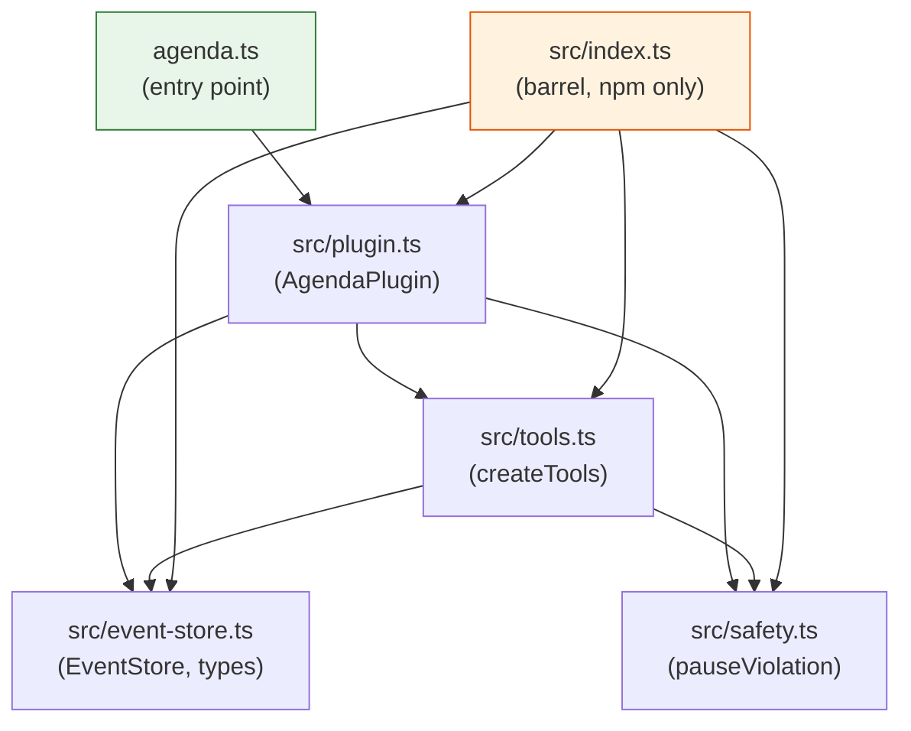
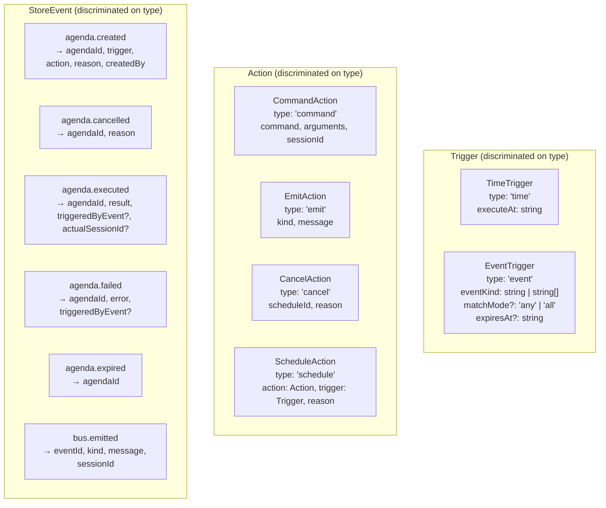
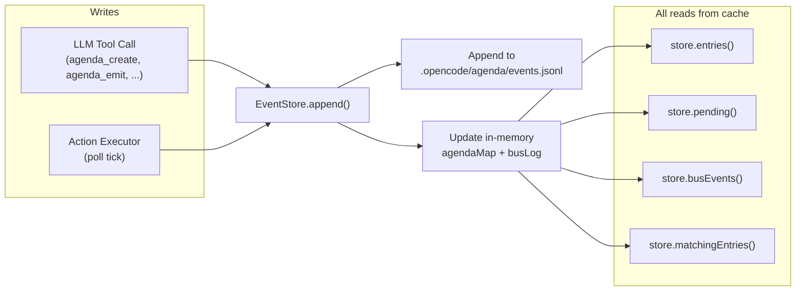
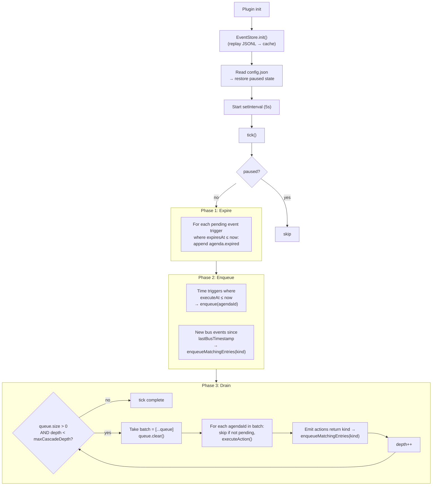
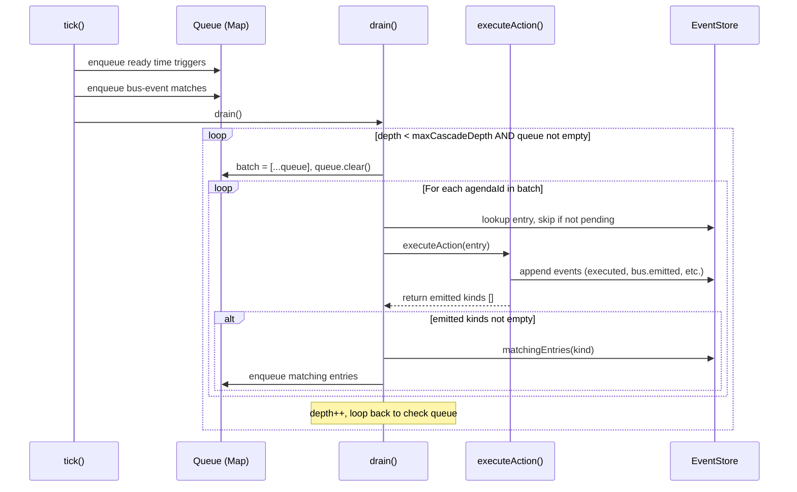
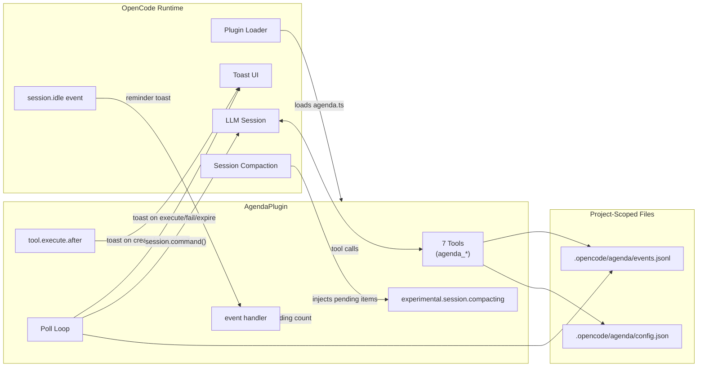
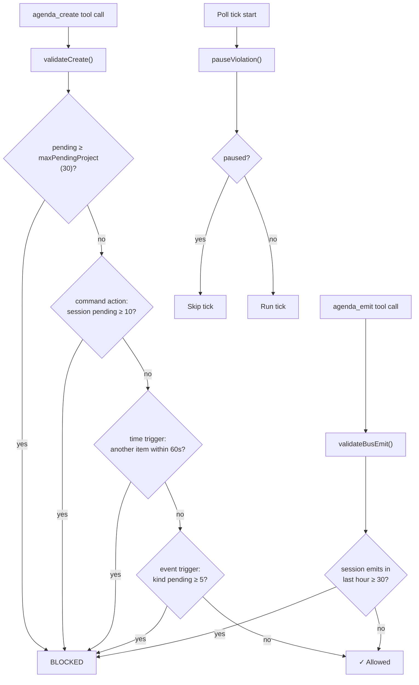

# Architecture

This document describes the internal architecture of `opencode-agenda-plugin`.

---

## Module Dependency Graph



**Two entry points exist by design:**

| Entry point | Consumer | What it exports |
|---|---|---|
| `agenda.ts` | OpenCode plugin loader (local file install) and `dist/agenda.js` (npm `main`) | Only `AgendaPlugin` |
| `src/index.ts` | npm consumers who import types or internals (`dist/src/index.js`) | Everything: plugin, store, tools, safety, all types |

OpenCode's plugin loader calls every export of a plugin file as a plugin function. If `index.ts` (which also exports `EventStore`, `createTools`, etc.) were the entry point, the loader would break. This is why `agenda.ts` exists as a minimal re-export.

---

## Type Hierarchy (Discriminated Unions)

All domain types use **discriminated unions** on the `type` field. No `Record<string, unknown>` payloads, no `as` casts on payload fields.



`ScheduleAction` is recursive: it embeds both `Action` and `Trigger`, enabling cascading schedule creation without LLM involvement.

---

## Event-Sourcing Data Flow

The system is fully event-sourced. All state is derived from an append-only JSONL log.



**Key property:** Disk is read once at `init()`. Every subsequent `append()` writes one line to disk and updates the in-memory cache. Reads never touch disk. This avoids full-file replay on every 5-second poll tick.

The only `as` cast in the store is `as StoreEvent` at the `JSON.parse` boundary during init replay — this is the accepted JSON deserialization boundary.

---

## Poll Loop & Task Queue

A single `setInterval` loop runs every 5 seconds. Each tick follows a three-phase pipeline: **expire → enqueue → drain**.

An idempotent task queue (`Map<agendaId, triggeredByEvent>`) sits between trigger detection and execution. Multiple sources can enqueue the same ID — the second call is a no-op. This eliminates the need for a mutex or any coordination between trigger types.



**Why a Map, not a Set:** The map value tracks `triggeredByEvent` — the bus event kind that caused the enqueue — which gets recorded in the `agenda.executed` event for audit. The idempotency property comes from the key: if an agendaId is already in the map, `enqueue()` is a no-op.

---

## Cascade Execution

Cascade is what happens when an action's side effect triggers another pending item. Instead of recursive function calls, cascade emerges naturally from the drain loop:

1. `executeAction()` for an emit action returns `["tests.passed"]`
2. `enqueueMatchingEntries("tests.passed")` adds matching pending items to the queue
3. The drain loop iterates again, picking up the newly enqueued items
4. Repeat until the queue is empty or `maxCascadeDepth` (default 8) drain iterations reached

This is **breadth-first** — all items from one wave execute before the next wave's items. No recursive calls, no depth parameter threaded through functions.



**Zero-cost actions** (`emit`, `cancel`, `schedule`) execute directly in the plugin process — no LLM tokens consumed. Only `command` actions invoke slash commands in sessions, which cost tokens.

The pending guard (`entry.status !== "pending"`) at drain time prevents double-execution — if a cancel action in the same batch already consumed an entry, it's skipped.

---

## OpenCode Integration Points



**Hooks used:**

| Hook | Purpose |
|---|---|
| `tool.execute.after` | Show toast notifications after LLM tool calls |
| `experimental.session.compacting` | Inject pending agenda summary into compacted context so the LLM doesn't lose track of scheduled items after compaction |
| `event` (`session.idle`) | Show a reminder toast when a session goes idle with pending items |

**Commands (markdown files in `commands/`):**

| Command | What it does |
|---|---|
| `/agenda` | Lists pending agenda items (user-facing, no LLM cost) |
| `/agenda-clear` | Cancels all pending items |
| `/agenda-pause` | Pauses execution |
| `/agenda-resume` | Resumes execution |

---

## Safety Rails

All safety checks are **synchronous pure functions** that read from the in-memory cache.



Pause state persists to `.opencode/agenda/config.json` so it survives plugin restarts.

---

## File Layout

```
opencode-agenda-plugin/
├── agenda.ts                  # Entry point (single export: AgendaPlugin)
├── package.json               # npm metadata, build scripts
├── tsconfig.json              # rootDir: ".", outDir: "dist"
├── LICENSE                    # MIT
├── README.md                  # Install + usage docs
├── ARCHITECTURE.md            # This file
├── src/
│   ├── plugin.ts              # AgendaPlugin: hooks, poll loop, task queue, action executor
│   ├── event-store.ts         # EventStore class, all domain types, pure functions
│   ├── safety.ts              # SafetyConfig, validation functions
│   ├── tools.ts               # createTools() → 7 agenda_* tools
│   └── index.ts               # Barrel exports (npm consumers only)
├── commands/
│   ├── agenda.md              # /agenda command
│   ├── agenda-clear.md        # /agenda-clear command
│   ├── agenda-pause.md        # /agenda-pause command
│   └── agenda-resume.md       # /agenda-resume command
├── dist/                      # tsc output (gitignored)
└── .github/
    └── workflows/
        └── publish.yml        # npm publish on version bump
```
