# Architecture

This document describes the internal architecture of `opencode-agenda-plugin`.

---

## Module Dependency Graph


**Two entry points exist by design:**

| Entry point | Consumer | What it exports |
|---|---|---|
| `agenda.ts` | OpenCode plugin loader (local file install) and `dist/agenda.js` (npm `main`) | Only `AgendaPlugin` |
| `src/index.ts` | npm consumers who import types or internals (`dist/src/index.js`) | Everything: plugin, store, tools, safety, all types |

OpenCode's plugin loader calls every export of a plugin file as a plugin function. If `index.ts` (which also exports `EventStore`, `createTools`, etc.) were the entry point, the loader would break. This is why `agenda.ts` exists as a minimal re-export.

---

## Type Hierarchy (Discriminated Unions)

```mermaid
graph TD
    subgraph Trigger ["Trigger (discriminated on type)"]
        TT["TimeTrigger<br/>type: 'time'<br/>executeAt: string"]
        ET["EventTrigger<br/>type: 'event'<br/>eventKind: string | string[]<br/>matchMode?: 'any' | 'all'<br/>expiresAt?: string"]
    end

    subgraph Action ["Action (discriminated on type)"]
        CA["CommandAction<br/>type: 'command'<br/>command, arguments, sessionId"]
        EA["EmitAction<br/>type: 'emit'<br/>kind, message"]
        XA["CancelAction<br/>type: 'cancel'<br/>scheduleId, reason"]
        SA["ScheduleAction<br/>type: 'schedule'<br/>action: Action, trigger: Trigger, reason"]
    end

    subgraph StoreEvent ["StoreEvent (discriminated on type)"]
        SE1["agenda.created<br/>→ agendaId, trigger, action, reason, createdBy"]
        SE2["agenda.cancelled<br/>→ agendaId, reason"]
        SE3["agenda.executed<br/>→ agendaId, result, triggeredByEvent?, actualSessionId?"]
        SE4["agenda.failed<br/>→ agendaId, error, triggeredByEvent?"]
        SE5["agenda.expired<br/>→ agendaId"]
        SE6["bus.emitted<br/>→ eventId, kind, message, sessionId"]
    end
```

All domain types use **discriminated unions** on the `type` field. No `Record<string, unknown>` payloads, no `as` casts on payload fields.



`ScheduleAction` is recursive: it embeds both `Action` and `Trigger`, enabling cascading schedule creation without LLM involvement.

---

## Event-Sourcing Data Flow

The system is fully event-sourced. All state is derived from an append-only JSONL log.


**Key property:** Disk is read once at `init()`. Every subsequent `append()` writes one line to disk and updates the in-memory cache. Reads never touch disk. This avoids full-file replay on every 5-second poll tick.

The only `as` cast in the store is `as StoreEvent` at the `JSON.parse` boundary during init replay — this is the accepted JSON deserialization boundary.

---

## Poll Loop Lifecycle

Two `setInterval` loops run at 5-second intervals, gated by a shared `processing` mutex.

```mermaid
flowchart TD
    Start["Plugin init"] --> Init["EventStore.init()<br/>(replay JSONL → cache)"]
    Init --> RestorePause["Read config.json<br/>→ restore paused state"]
    RestorePause --> Loops["Start intervals"]

    Loops --> TL["⏱ timeTick<br/>(every 5s)"]
    Loops --> EL["📡 eventTick<br/>(every 5s)"]

    TL --> MutexT{"processing?"}
    MutexT -- yes --> SkipT["skip"]
    MutexT -- no --> PauseT{"paused?"}
    PauseT -- yes --> SkipT
    PauseT -- no --> LockT["processing = true"]
    LockT --> ScanT["Scan pending time triggers<br/>where executeAt ≤ now"]
    ScanT --> ExecT["executeAction() for each"]
    ExecT --> UnlockT["processing = false"]

    EL --> MutexE{"processing?"}
    MutexE -- yes --> SkipE["skip"]
    MutexE -- no --> PauseE{"paused?"}
    PauseE -- yes --> SkipE
    PauseE -- no --> LockE["processing = true"]
    LockE --> Expire["Expire stale event triggers<br/>where expiresAt ≤ now"]
    Expire --> NewBus["Find bus events since<br/>lastBusTimestamp"]
    NewBus --> ProcessEmit["processEmit() for each<br/>new bus event kind"]
    ProcessEmit --> UnlockE["processing = false"]
```



The shared `processing` flag ensures that `timeTick` and `eventTick` never overlap, preventing double-execution of the same agenda item.

---

## Cascade Execution

When an action emits a bus event, the plugin immediately checks for matching pending event-triggered items and executes them in the same tick — recursively, up to `maxCascadeDepth` (default 8).


**Zero-cost actions** (`emit`, `cancel`, `schedule`) execute directly in the plugin process — no LLM tokens consumed. Only `command` actions invoke slash commands in sessions, which cost tokens.

The re-check (`store.pending()` before executing each match) prevents double-execution when a prior cascade step already consumed an entry.

---

## OpenCode Integration Points


**Hooks used:**

| Hook | Purpose |
|---|---|
| `tool.execute.after` | Show toast notifications after LLM tool calls |
| `experimental.session.compacting` | Inject pending agenda summary into compacted context so the LLM doesn't lose track of scheduled items after compaction |
| `event` (`session.idle`) | Show a reminder toast when a session goes idle with pending items |

**Commands (markdown files in `commands/`):**

| Command | What it does |
|---|---|
| `/agenda` | Lists pending agenda items (user-facing, no LLM cost) |
| `/agenda-clear` | Cancels all pending items |
| `/agenda-pause` | Pauses execution |
| `/agenda-resume` | Resumes execution |

---

## Safety Rails

All safety checks are **synchronous pure functions** that read from the in-memory cache.

```mermaid
flowchart TD
    Create["agenda_create tool call"] --> VC["validateCreate()"]
    Emit["agenda_emit tool call"] --> VE["validateBusEmit()"]
    Tick["Poll tick start"] --> VP["pauseViolation()"]

    VC --> C1{"pending ≥ maxPendingProject<br/>(30)?"}
    C1 -- yes --> Block["BLOCKED"]
    C1 -- no --> C2{"command action:<br/>session pending ≥ 10?"}
    C2 -- yes --> Block
    C2 -- no --> C3{"time trigger:<br/>another item within 60s?"}
    C3 -- yes --> Block
    C3 -- no --> C4{"event trigger:<br/>kind pending ≥ 5?"}
    C4 -- yes --> Block
    C4 -- no --> OK["✓ Allowed"]

    VE --> R1{"session emits in<br/>last hour ≥ 30?"}
    R1 -- yes --> Block
    R1 -- no --> OK

    VP --> P1{"paused?"}
    P1 -- yes --> SkipTick["Skip tick"]
    P1 -- no --> RunTick["Run tick"]
```



Pause state persists to `.opencode/agenda/config.json` so it survives plugin restarts.

---

## File Layout

```
opencode-agenda-plugin/
├── agenda.ts                  # Entry point (single export: AgendaPlugin)
├── package.json               # npm metadata, build scripts
├── tsconfig.json              # rootDir: ".", outDir: "dist"
├── LICENSE                    # MIT
├── README.md                  # Install + usage docs
├── ARCHITECTURE.md            # This file
├── src/
│   ├── plugin.ts              # AgendaPlugin: hooks, poll loops, action executor
│   ├── event-store.ts         # EventStore class, all domain types, pure functions
│   ├── safety.ts              # SafetyConfig, validation functions
│   ├── tools.ts               # createTools() → 7 agenda_* tools
│   └── index.ts               # Barrel exports (npm consumers only)
├── commands/
│   ├── agenda.md              # /agenda command
│   ├── agenda-clear.md        # /agenda-clear command
│   ├── agenda-pause.md        # /agenda-pause command
│   └── agenda-resume.md       # /agenda-resume command
├── dist/                      # tsc output (gitignored)
└── .github/
    └── workflows/
        └── publish.yml        # npm publish on version bump
```
